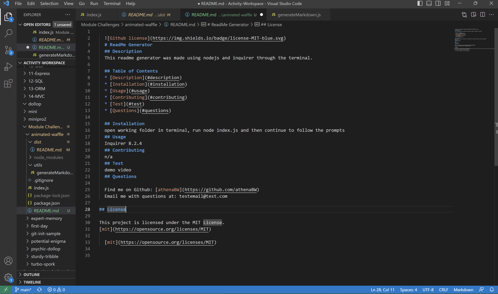

  
  # ReadMe Generator
  ## Description
  This readme generator was made using nodejs and inquirer through the terminal.
 
  ## Table of Contents
  * [Description](#description)
  * [Installation](#installation)
  * [Usage](#usage)
  * [Contributing](#contributing)
  * [Test](#test)
  * [Questions](#questions)
  
  ## Installation
  open working folder in terminal, run node index.js and then continue to follow the prompts
  ## Usage 
  Inquirer 8.2.4
  ## Contributing
  n/a
  ## Test
  demo video 
  ## Questions 
  
  Find me on Github: [athenaBW](https://github.com/athenaBW)
  Email me with questions at: testemail@test.com 
  
## License

This project is licensed under the MIT License. 
[mit](https://opensource.org/licenses/MIT)

  [mit](https://opensource.org/licenses/MIT)

  